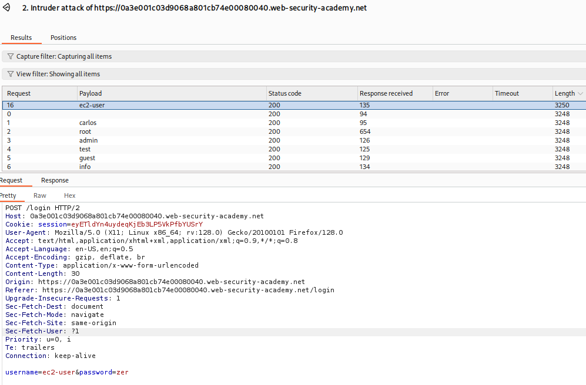

# 1. Path Traversal

Lets you access any directory by using ../../../ to go back to home directory
This can be dangerous if we can access some sensitive files such as /etc/passwd

### Lab Solution

```bash
GET /image?filename=../../../../../../../etc/passwd HTTP/2
```


# 2. Access Control

### Vertical Privelage Escalation

When a normal user gain access to functionality they are not allowed to access

### Lab 1 Solution

```bash
Look at /robots.txt u will find admin panel, browse to admin panel
```

### Lab 2 Solution

After browsing through the source code we find an admin function that discloses admin directory

```javascript
var isAdmin = false;
if (isAdmin) {
   var topLinksTag = document.getElementsByClassName("top-links")[0];
   var adminPanelTag = document.createElement('a');
   adminPanelTag.setAttribute('href', '/admin-7ey9aw');
   adminPanelTag.innerText = 'Admin panel';
   topLinksTag.append(adminPanelTag);
   var pTag = document.createElement('p');
   pTag.innerText = '|';
   topLinksTag.appendChild(pTag);
}
```

## Parameter-based access control methods

 Some applications determine the user's access rights or role at login, and then store this information in a user-controllable location. This could be:

    A hidden field.
    A cookie.
    A preset query string parameter.

The application makes access control decisions based on the submitted value. For example:

```bash
https://insecure-website.com/login/home.jsp?admin=true
https://insecure-website.com/login/home.jsp?role=1
```

This approach is insecure because a user can modify the value and access functionality they're not authorized to, such as administrative functions. 

### Lab 3 Solution

Frist we login with the credentials given

After we login we can capture any activity we preform using the normal user

for exammple in this case we can reset our gmail

After capturing the action with burpsuite we find a paramter called Admin set to False

```
POST /admin HTTP/2
Host: 0a2100af039b86b3800612b300df00e8.web-security-academy.net
Cookie: session=CeC2SKdpdnyio6cj27ZreGfd0kjQOCEt; Admin=True
```

We can Simply set its value to true and preform the delete carlos user action to solve the lab

```
POST /admin/delete?username=carlos HTTP/2
```

## Horizontal Privelage Escalation

 Horizontal privilege escalation occurs if a user is able to gain access to resources belonging to another user, instead of their own resources of that type. For example, if an employee can access the records of other employees as well as their own, then this is horizontal privilege escalation.

Horizontal privilege escalation attacks may use similar types of exploit methods to vertical privilege escalation. For example, a user might access their own account page using the following URL:
https://insecure-website.com/myaccount?id=123

If an attacker modifies the id parameter value to that of another user, they might gain access to another user's account page, and the associated data and functions.
Note

This is an example of an insecure direct object reference (IDOR) vulnerability. This type of vulnerability arises where user-controller parameter values are used to access resources or functions directly.

In some applications, the exploitable parameter does not have a predictable value. For example, instead of an incrementing number, an application might use globally unique identifiers (GUIDs) to identify users. This may prevent an attacker from guessing or predicting another user's identifier. However, the GUIDs belonging to other users might be disclosed elsewhere in the application where users are referenced, such as user messages or reviews. 

### Lab 4 Solution

We first login in with the credentials given

We find that each user has a unique GUID

After looking through some posts on the website, we find a post by our target user "carlos", and after clicking on carlos, we find that it discloses the GUID of carlos, which can be used to login as carlos and find the Solution

We login to this guid with this link

```
https://0a340040049e06d7800ab236008900a7.web-security-academy.net/my-account?id=a4a5e1f1-99e5-43e0-81d0-ce42f11bbe6a
```

#### Horizontal to vertical privilege escalation

Often, a horizontal privilege escalation attack can be turned into a vertical privilege escalation, by compromising a more privileged user. 
For example, a horizontal escalation might allow an attacker to reset or capture the password belonging to another user. If the attacker targets an administrative user and compromises their account, then they can gain administrative access and so perform vertical privilege escalation.

An attacker might be able to gain access to another user's account page using the parameter tampering technique already described for horizontal privilege escalation:

`https://insecure-website.com/myaccount?id=456`

If the target user is an application administrator, then the attacker will gain access to an administrative account page. This page might disclose the administrator's password or provide a means of changing it, or might provide direct access to privileged functionality.

### Lab 5 Solution

First we login with the given credentials to the lab website
When we go to the my-account page, we see that our user has a password hidden with javascript

We can easily go to the sourcecode and reveal the current password

We also see that our page has a parameter "?id=wiener"
The idea is to change the use wiener to "administrator", that lets us access the admin account configuration page and reveal the password for administrator

which we ca use then to delete carlos and solve the lab

## 

# 3. Authentication vulnerabilities

Conceptually, authentication vulnerabilities are easy to understand. However, they are usually critical because of the clear relationship between authentication and security.

Authentication vulnerabilities can allow attackers to gain access to sensitive data and functionality. They also expose additional attack surface for further exploits. For this reason, it's important to learn how to identify and exploit authentication vulnerabilities, and how to bypass common protection measures.

In this section, we explain:

- The most common authentication mechanisms used by websites.

- Potential vulnerabilities in these mechanisms.

- Inherent vulnerabilities in different authentication mechanisms.

- Typical vulnerabilities that are introduced by their improper implementation.

- How you can make your own authentication mechanisms as robust as possible.

## What is the difference between authentication and authorization?

Authentication is the process of verifying that a user is who they claim to be. Authorization involves verifying whether a user is allowed to do something.

For example, authentication determines whether someone attempting to access a website with the username `Carlos123` really is the same person who created the account.

Once `Carlos123` is authenticated, their permissions 
determine what they are authorized to do. For example, they may be authorized to access personal information about other users, or perform actions such as deleting another user's account.

## Brute-force attacks

A brute-force attack is when an attacker uses a system of trial and error to guess valid user credentials. These attacks are typically automated using wordlists of usernames and passwords. Automating this process, especially using dedicated tools, potentially enables an attacker to make vast numbers of login attempts at high speed.

Brute-forcing is not always just a case of making completely random guesses at usernames and passwords. By also using basic logic or publicly available knowledge, attackers can fine-tune brute-force attacks to make much more educated guesses. This considerably increases the efficiency of such attacks. Websites that rely on password-based login as their sole method of authenticating users can be highly vulnerable if they do not implement sufficient brute-force protection.

## Brute-forcing usernames

Usernames are especially easy to guess if they conform to a 
recognizable pattern, such as an email address. For example, it is very common to see business logins in the format `firstname.lastname@somecompany.com`. However, even if there is no obvious pattern, sometimes even high-privileged accounts are created using predictable usernames, such 
as `admin` or `administrator`.

During auditing, check whether the website discloses potential 
usernames publicly. For example, are you able to access user profiles without logging in? Even if the actual content of the profiles is hidden, the name used in the profile is sometimes the same as the login username. You should also check HTTP responses to see if any email addresses are disclosed. Occasionally, responses contain email addresses of high-privileged users, such as administrators or IT support.

## Brute-forcing passwords

Passwords can similarly be brute-forced, with the difficulty varying based on the strength of the password. Many websites adopt some form of password policy, which forces users to create high-entropy passwords that are, theoretically at least, harder to crack using brute-force alone. This typically involves enforcing passwords with:

- A minimum number of characters
- A mixture of lower and uppercase letters
- At least one special character

## Brute-forcing passwords - Continued

However, while high-entropy passwords are difficult for computers alone to crack, we can use a basic knowledge of human behavior to exploit the vulnerabilities that users unwittingly introduce to this system. Rather than creating a strong password with a random combination of characters, users often take a password that they can remember and try to crowbar it into fitting the password policy. For example, if `mypassword` is not allowed, users may try something like `Mypassword1!` or `Myp4$$w0rd` instead.

In cases where the policy requires users to change their passwords on a regular basis, it is also common for users to just make minor, predictable changes to their preferred password. For example, `Mypassword1!` becomes `Mypassword1?` or `Mypassword2!.`This knowledge of likely credentials and predictable patterns means that brute-force attacks can often be much more sophisticated, and 
therefore effective, than simply iterating through every possible combination of characters.

## Username enumeration

Username enumeration is when an attacker is able to observe changes in the website's behavior in order to identify whether a given username is valid.

Username enumeration typically occurs either on the login page, for example, when you enter a valid username but an incorrect password, or on registration forms when you enter a username that is already taken. 
This greatly reduces the time and effort required to brute-force a login because the attacker is able to quickly generate a shortlist of valid usernames.

### Lab 1 Soution

We have been given a list of candidate usernames and passwords to solve this lab

First after we try a random combination of username and password, we find that the website says "Incorrect username" which means we can do some username enumeration using the candidate usernames list using the intruder tool in burpsuite



We find that the user "ec2-user" is giving a different response link, and after checking the response we see that this time it says "Incorrect password"
We conclude that the correct username is "ec2-user"
Now we will try the same thing but this time we use "ec2-user"  for the username and bruteforce the password


